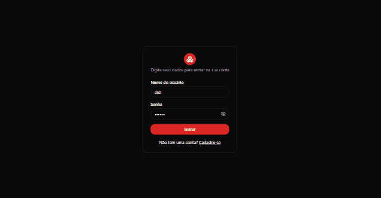

## GM Estoque

Uma aplicação projetada para otimizar o controle de produtos armazenados, permitindo que os usuários rastreiem, organizem e administrem seus estoques de maneira eficiente e precisa podendo associar a um fornecedor e categoria.

### Para rodar o projeto: (Observação: Back end precisa ter o Docker instalado na sua máquina)

```bash
Front End:
cd web
npm i
npm run dev

Back End:
docker compose up -d --build
```

Abrir [http://localhost:5173](http://localhost:5173) para visualizar o front end. <br />
Abrir [http://localhost:3001](http://localhost:3001) para consumir o back end.

<hr><br>



## Tecnologias

O projeo foi desenvovido com as seguintes tecnologias:

### Front End:
- React
- Typescript
- Tailwind
- Shadcn
- Rect Hook Form
- Zod
- React Router DOM
- Radix UI

### Back End:
- Typescript
- Nestjs
- Prisma
- postgresql

---

Linkedin de Matheus Bezerra --> <a href="https://www.linkedin.com/in/matheus-bezerra04/">Matheus-Bezerra04</a> <br />
Linkedin de Giovanni Castro --> <a href="https://www.linkedin.com/in/giovannicm/">giovannicm</a>
